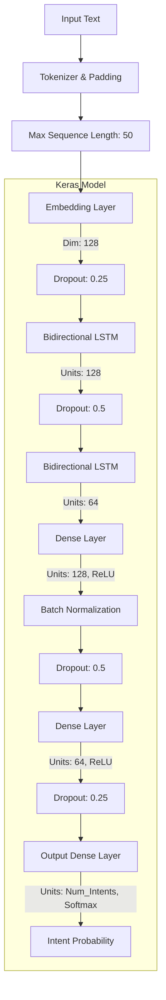

# Model Architecture: Bidirectional LSTM Intent Classifier

LinguaBot uses an intent classification architecture designed for fast inference and solid accuracy on short-text conversation domains. It trains separate, identical architectural models for each supported language (English, Hindi, Kannada) to prevent vocabulary collision and optimize embedding space for each script.

## Network Architecture

## Data Preprocessing Pipeline

1. **Cleaning**: Removal of special characters, punctuation, and multiple spaces.
2. **Language Specific**:
   - **English**: Tokenization and Lemmatization (using NLTK WordNet).
   - **Hindi**: Transliteration check (Roman to Devanagari) + cleanup.
   - **Kannada**: Standard cleanup.
3. **Tokenization**: Keras `Tokenizer` maps words to integer indices (`<OOV>` for unknown).
4. **Padding**: Post-padding to a fixed `MAX_SEQUENCE_LENGTH` of 50.

## Hyperparameters

- **Embedding Dimension**: 128
- **LSTM Units**: 128 (first layer), 64 (second layer)
- **Dropout Rate**: 0.5 (Base), 0.25 (Spatial)
- **Batch Size**: 32
- **Optimizer**: Adam (learning_rate=0.001)
- **Loss Function**: Categorical Crossentropy

## Training Lifecycle

- **Callbacks utilized**:
  - `EarlyStopping`: Monitors validation loss, patience 15 epochs. Restores best weights.
  - `ReduceLROnPlateau`: Reduces learning rate by factor of 0.5 if validation loss stagnates for 5 epochs.
  - `ModelCheckpoint`: Saves the `.h5` model with the highest validation accuracy.
- **Metrics Tracked**: Accuracy and Loss (Training & Validation).

## Language Detection

Before hitting the NLP pipeline, input passes through `LanguageDetector`:
1. **Regex Script Matching**: Checks for Devanagari (`\u0900-\u097F`) or Kannada (`\u0C80-\u0CFF`) Unicode blocks. This is `O(n)` fast and accurate for native scripts.
2. **langdetect Library**: Fallback for Latin script/Romanized Indian languages.

## Response Generation
Post-classification, the highest probability intent is selected. If confidence is below `0.65`, the system falls back to a generic `fallback` intent to gracefully handle out-of-domain queries. A response is randomly selected from the intent's `responses` array to provide conversational variance.
